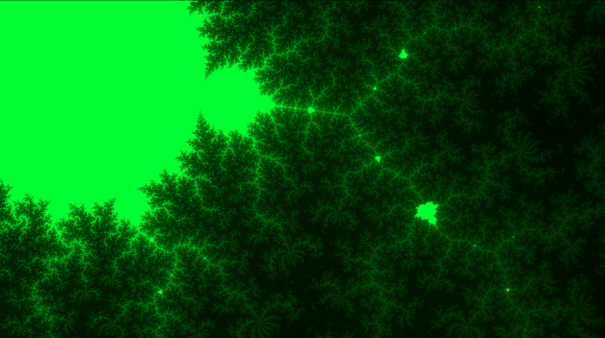

# The Mandelverse - Mandelbrot Set Explorer

An interactive Mandelbrot fractal explorer built with Vue 3. Inspired by this great [article](https://slicker.me/fractals/fractals.htm)



The Mandelbrot set is a famous fractal — a complex, infinitely detailed mathematical shape that exhibits self-similarity at every scale. It’s defined by iterating the simple equation

$$
z_{n+1} = z_n^2 + c
$$

where both **z** and **c** are complex numbers. A point **c** belongs to the Mandelbrot set if the sequence remains bounded (doesn’t escape to infinity).

When visualized, the Mandelbrot set reveals intricate, beautiful patterns that repeat endlessly, showing how complex structures can emerge from simple mathematical rules. 


With this simple website, I wanted to dive deeper into this great equation, and give the user total freedom to explore the set and find its beautiful and hidden visuals. 

> [!IMPORTANT]  
> The video detail settings are limited to ensure there are no performance issues and runs smoothly. Adding more iterations and smaller pixel scale takes a big hit on CPU usage. I am planning on optimizing this in the future, but for now we keep video settings limited.


## Features

- Automatic Zoom to clicked point on set
- Automatic zoom to selected region of set
- Pre-defined interesting fractal regions
- Random exploration mode (automatic jump through regions)
- Record explorer and export as `.webm` or `.gif`
- Zoom behavior settings
- Boring region detection
- Multiple color themes
- Mobile friendly!

## How to run it locally?

```bash
npm install
npm run dev
```

## Is this hosted?
It is publicly hosted and can be found here:
https://mandelverse.netlify.app/
